## The Dashboard:

### The home page:

The main page contains charts related to the progress of current medications and the user's commitment to his medications. On the right, we see the graphs, and on the left an introductory text and a set of buttons that are used to control the charts. At the top there is a button to navigate between the dashboard pages

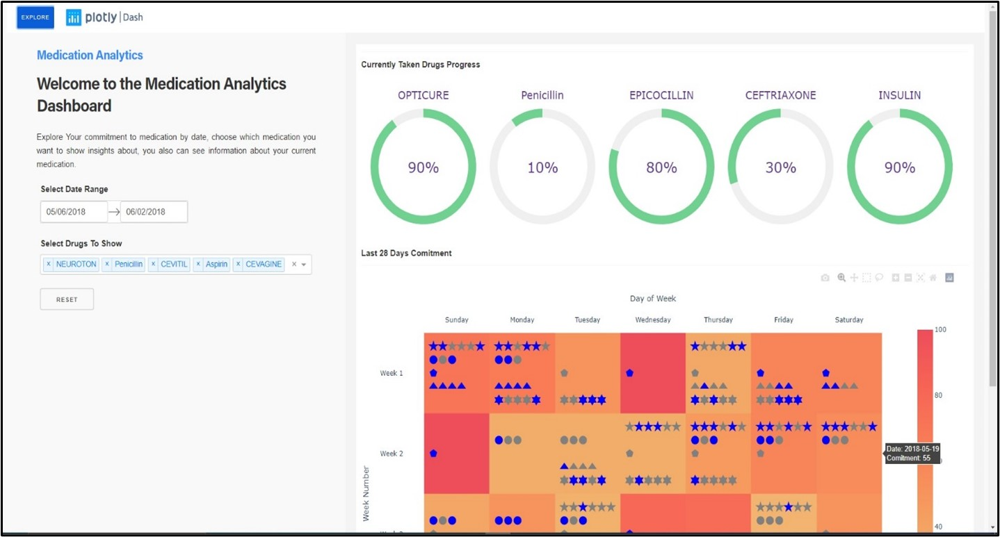

### Home page charts:

1.  At the top there are set of pie charts, one for each drug. Each chart represents an individual drug, and the ratio within it expresses progress in taking the drug.

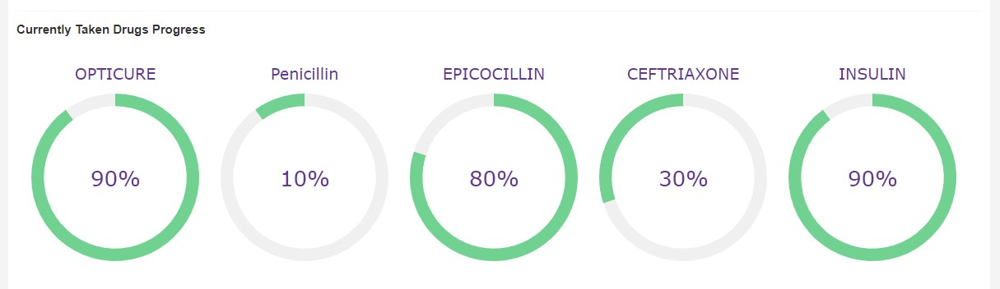

1.  At the bottom there is a chart showing the user’s commitment to his medications in the last 28 days. The chart consists of a heatmap inside it scatter plots. The heatmap expresses the extent of the user’s commitment to all his medications on a particular day. The more committed the user is, the redder the color in the box representing the day. The scatter is used to express a single drug and its doses, each drug has a unique symbol representing it and a color representing the dose status whether blue if the user takes his dose or gray if he missed it.

### Home page means of interactivity:

The home page contains several means of user interaction.

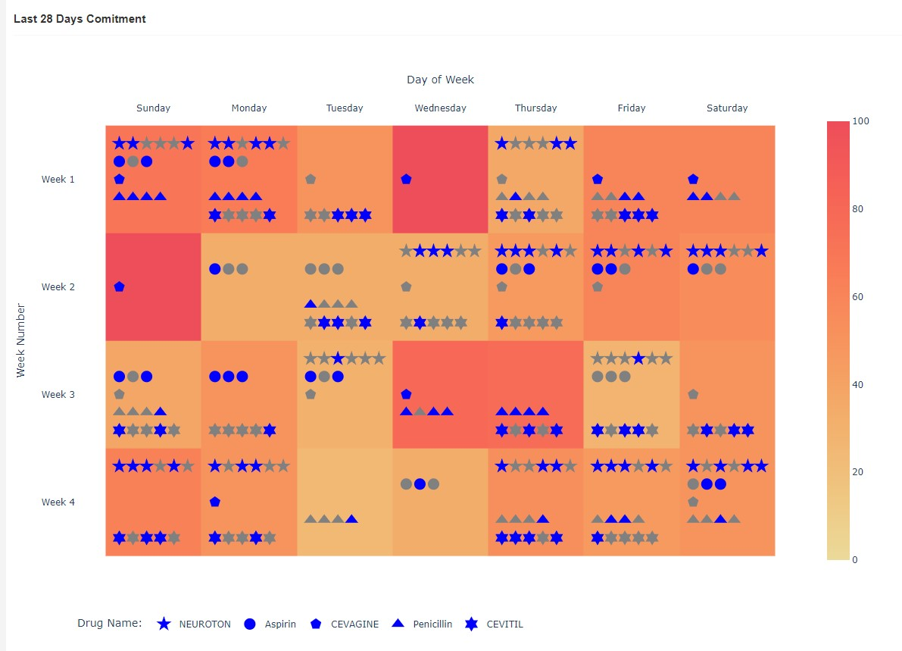

-   On the left of the page there is a calendar in which user can control the date range for displaying the commitment chart. He can also choose certain medications to display instead of all medications, in addition to a reset button to return the chart to its default appearance.

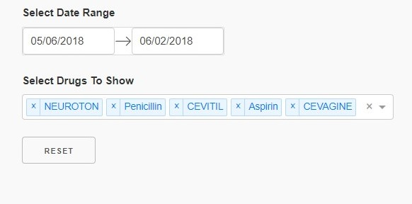

-   At the bottom of the commitment chart there is an interactive legend that user can hide and display the existing drugs by clicking on them.

-   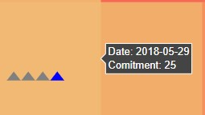When user hovers over a field in the commitment chart, a more informative data that is not present in the chart appears, such as the date and the actual percentage of commitment.
-   in addition to the Plotly toolbar, through which user can save the chart or zoom in and navigate through the chart and many more.

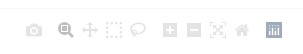

### The explore button

The explore button at the top allows the user to navigate between the dashboard pages

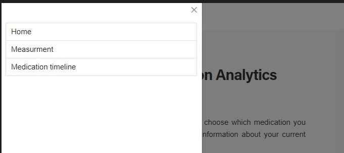

### Measurement page

Same as home page layout, On the right, we see charts, and on the left an introductory text and a set of buttons that are used to control the figure, the page contains a set of line charts describing the change in user vitals over the time.

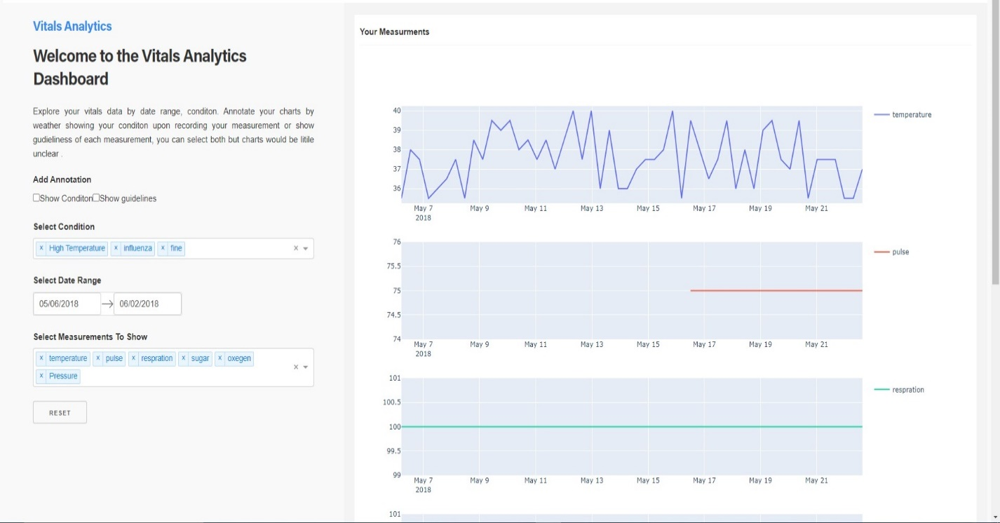

### Measurement page charts:

Single figure consist of many virtical subplots each subplot represent a vital.

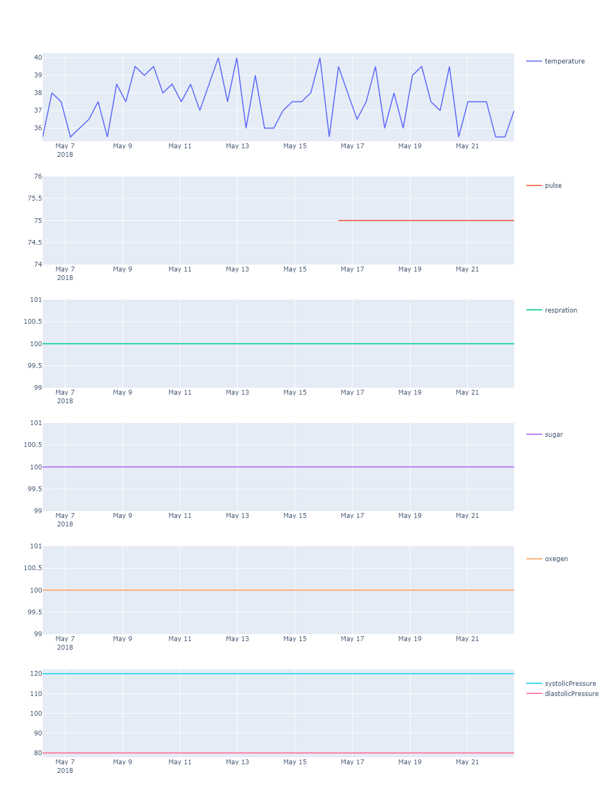

### Measurement page means of interactivity:

-   On the left of the page there is a calendar by which the user controls the date range to see measurements within. He can also choose to display information for one or more condition, control which vitals to show insights, in addition to a reset button to return the chart to its default appearance and some useful annotations.

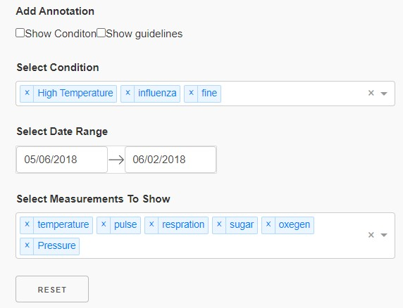

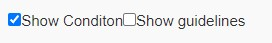Show condition annotation:

Coloring regions of the chart for each condition to allow user seeing at which condition these measurements recorded.

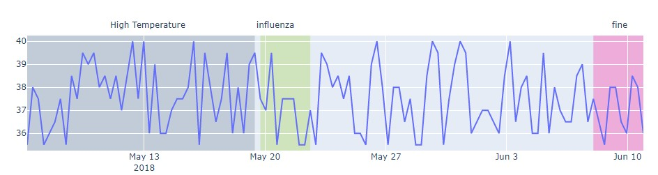

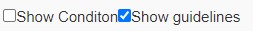Show guidelines annotation:

Show the user information about vital he is looking at, indicating the critical values of vitals and to what extent values are critical

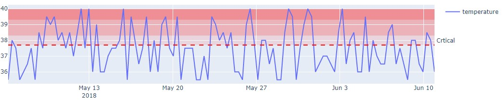

-   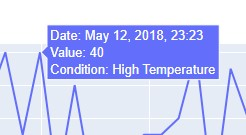When the user hovers over a data point in the chart, a more informative data will show off.
-   In addition to the Plotly toolbar.

### Medication timeline page

This page contains insights about user whole medication history, the figure consists of many horizontal bar charts, designed to handle a long timeline full of medication as well as gaps.

Interactivity includes date range selection, selection of drugs, selection of doctors, informative data when hovering and many more.

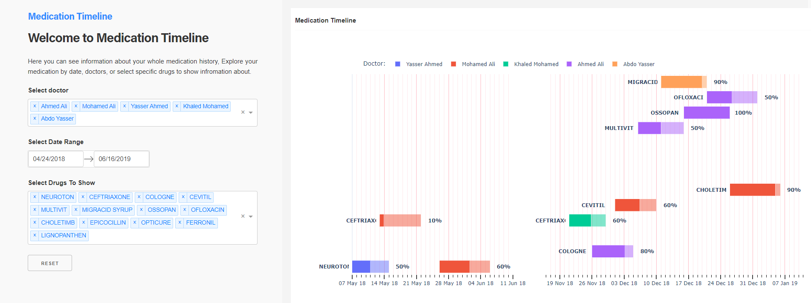
